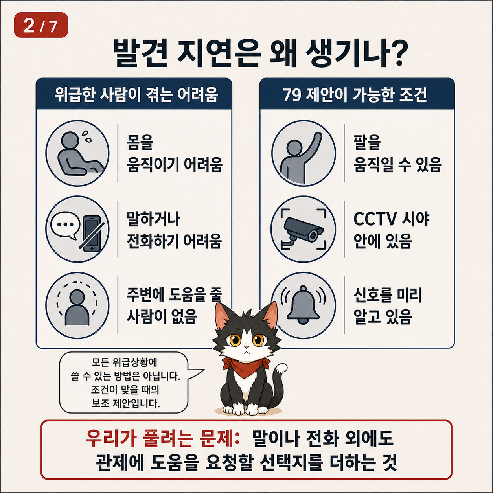
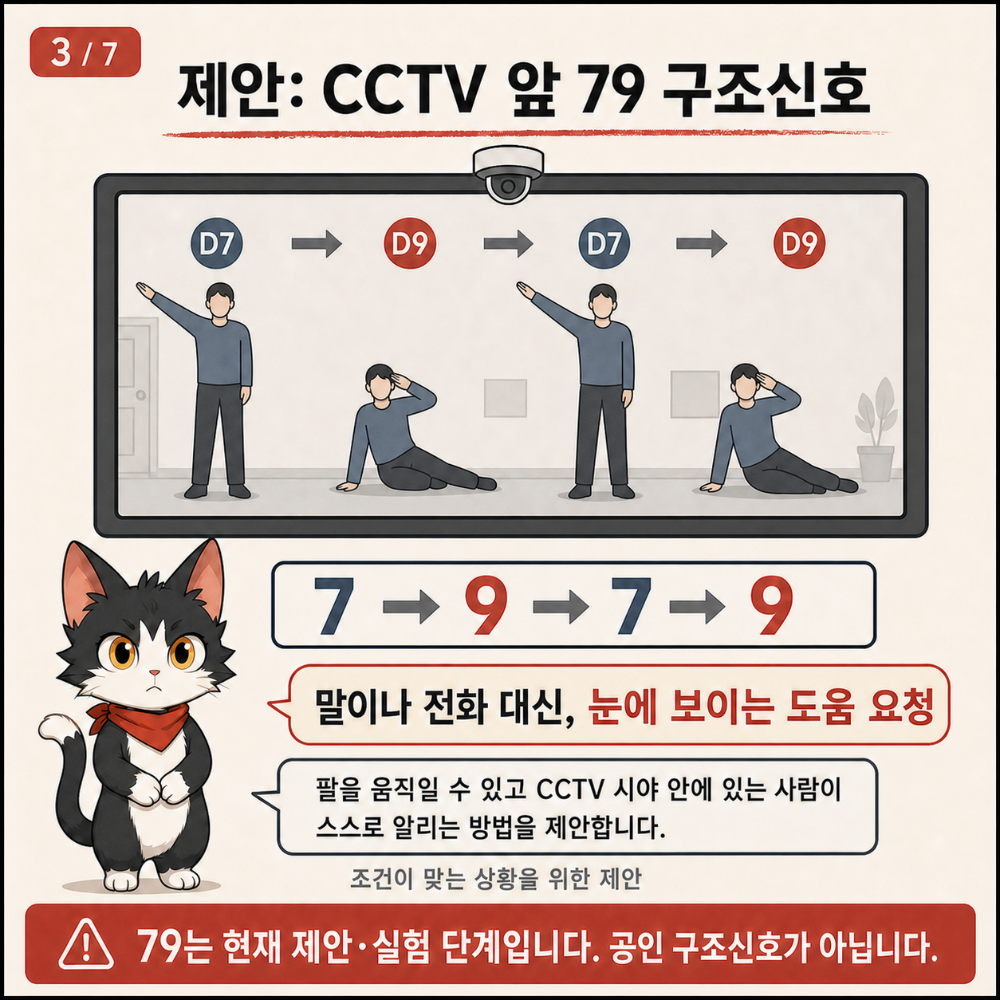
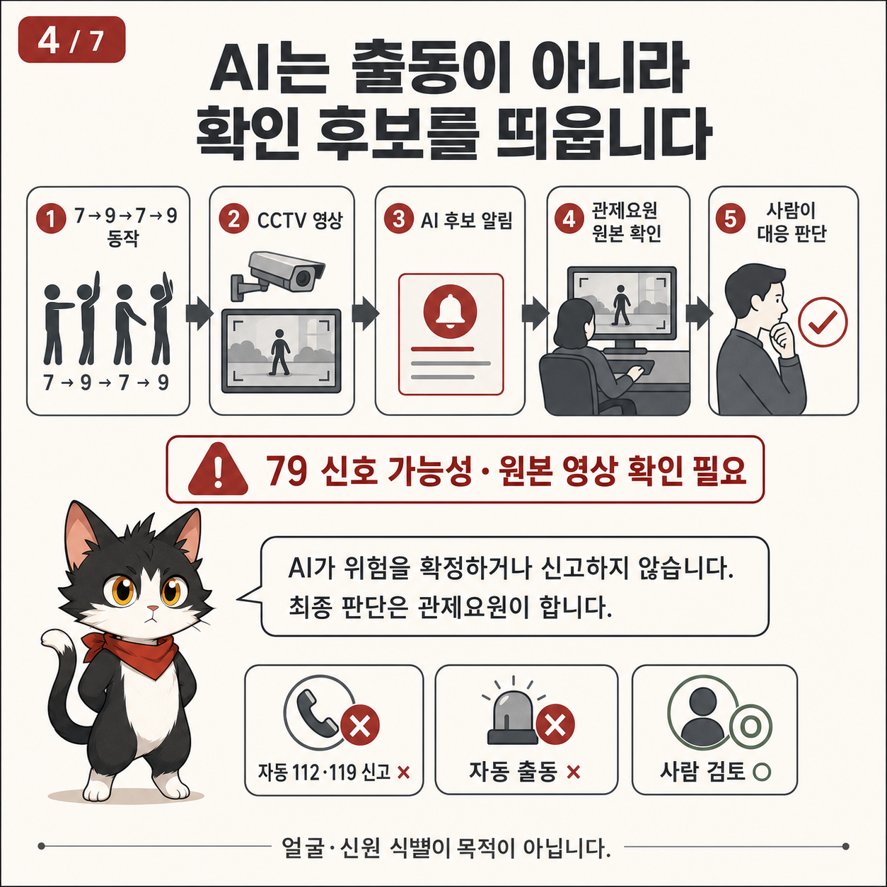
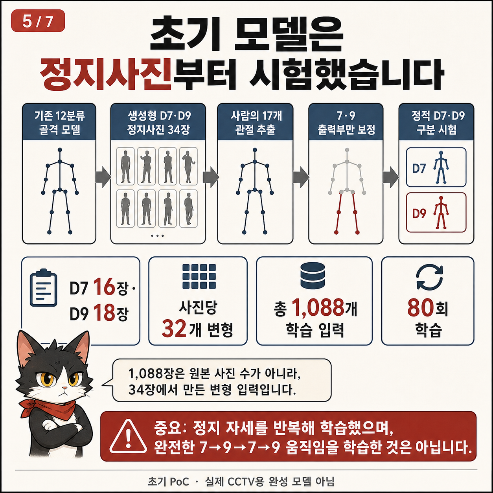
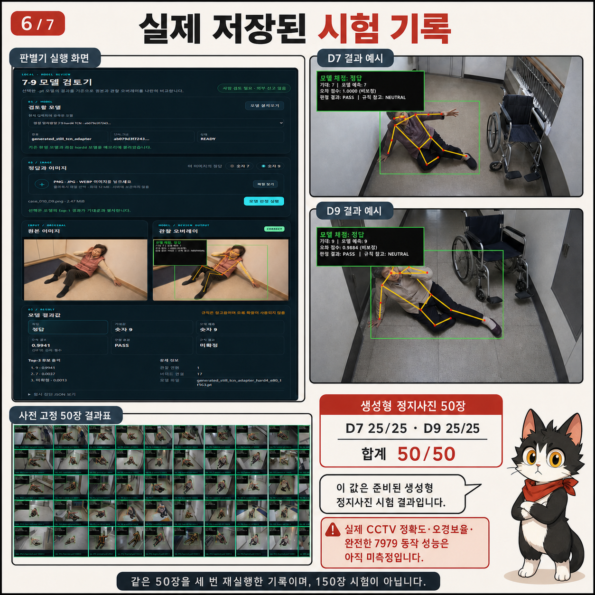
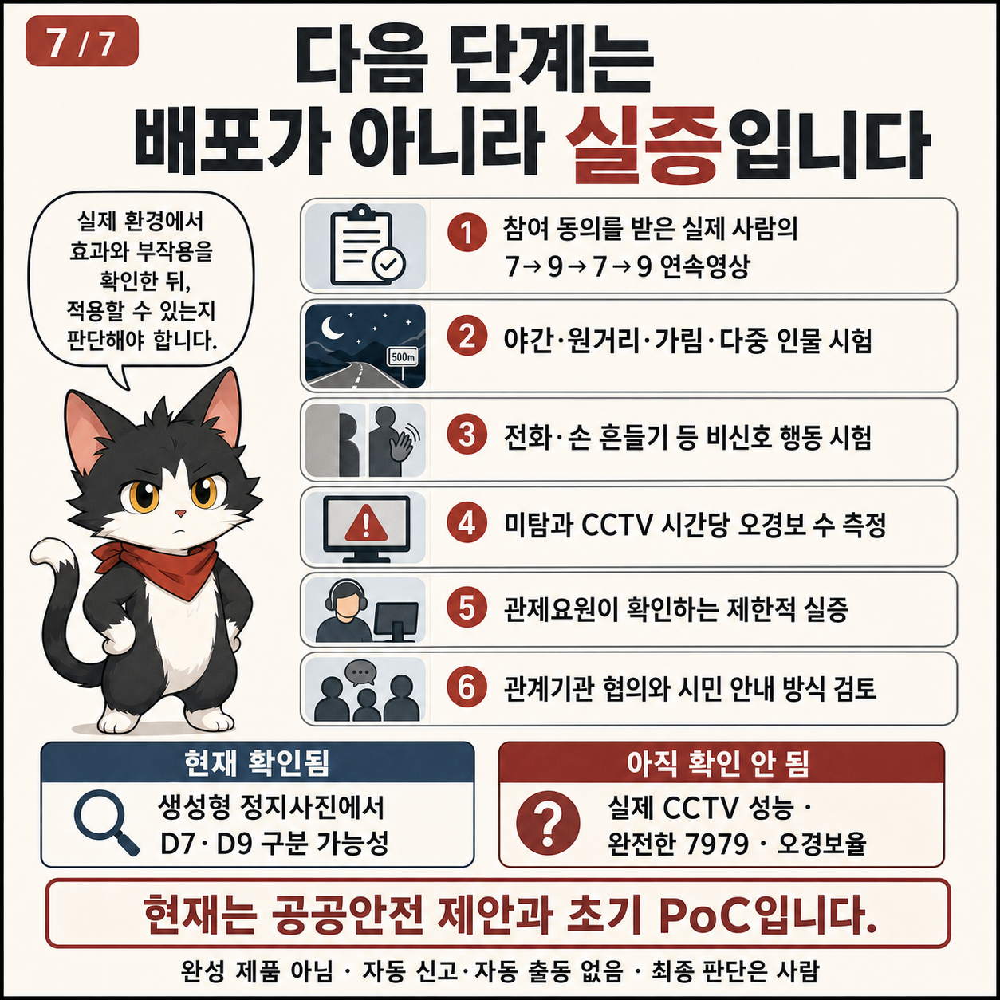

# gonggong-disaster-series-rescue79

## 발견 지연을 줄이기 위한 CCTV 79 구조신호 제안·초기 PoC

폭염·한파 노출, 낙상, 갑작스러운 몸 이상, 외진 곳에서의 고립처럼 위급한
상황에서는 당사자가 말하거나 전화하기 어려울 수 있습니다. 이 프로젝트는 그런
상황에서 **팔을 움직일 수 있고 CCTV 시야 안에 있는 사람**이 미리 약속한
`7→9→7→9` 자세로 도움을 요청하고, AI가 관제요원에게 **원본 영상을 다시 볼
후보**를 띄우는 방법을 제안합니다.

> **현재 단계: 공공안전 제안·초기 PoC**
>
> - 바로 현장에 설치하는 완성 제품이나 시민용 구조 앱이 아닙니다.
> - 현재 공개한 모델은 정지사진 한 장의 D7·D9 자세를 검토하는 연구 구성요소입니다.
> - 실제 CCTV, 완전한 `7→9→7→9`, 오경보율과 현장 운영 속도는 아직 검증하지 않았습니다.
> - 79는 공인 구조신호나 국가표준이 아닌 사용자 정의 제안입니다.
> - AI는 위험을 확정하거나 자동으로 112·119에 신고·출동시키지 않습니다.
> - 원본 확인과 최종 판단은 항상 사람이 담당합니다.


## 우리가 풀어 보려는 문제

상황은 달라도 다음과 같은 공통된 어려움이 있을 수 있습니다.

- 폭염·한파에 장시간 노출됨
- 넘어지거나 갑자기 몸 상태가 나빠져 움직이기 어려움
- 외진 곳이나 혼자 있는 곳에서 주변 도움을 받기 어려움
- 말하거나 휴대전화를 사용하기 어려움

이때 `위급상황 발생 → 스스로 알리기 어려움 → 발견 지연 → 대응 지연`으로
이어질 수 있습니다. Rescue79가 겨냥하는 것은 사고 원인을 자동 판정하는 일이
아니라, **도움을 요청할 수 있는 선택지를 하나 더 만드는 것**입니다.



79 제안은 모든 위급상황에 적용할 수 없습니다. 적어도 다음 조건이 필요합니다.

1. 당사자가 팔을 움직일 수 있어야 합니다.
2. 몸과 팔이 CCTV 시야에 충분히 보여야 합니다.
3. 시민과 관제기관이 신호의 뜻을 미리 알고 있어야 합니다.
4. 신호를 수행하기 어려운 사람을 위한 다른 수단도 함께 마련해야 합니다.

따라서 비상벨, 휴대전화·웨어러블, 낙상·장시간 미동 후보 탐지, 현장 순찰 같은
방법을 대체하는 것이 아니라 보완하는 제안입니다.

## 제안: 눈에 보이는 79 도움 요청

이 프로젝트에서 시험한 정적 자세는 다음과 같습니다.

- **D7:** 한 팔을 몸 옆이나 대각선 방향으로 뻗는 자세
- **D9:** 한 손을 머리 가까이에 두는 자세
- **제안 순서:** `D7 → D9 → D7 → D9`

좌우 팔을 바꾸어도 같은 자세로 보는 실험안입니다. 머리 긁기, 전화받기, 모자
만지기처럼 D9와 비슷한 일상행동이 있으므로 한 장의 D9만으로 구조 요청을
판정해서는 안 됩니다.



## 제안하는 목표 흐름

```text
시민의 7→9→7→9 동작
        ↓
CCTV 영상에서 후보 확인
        ↓
AI가 관제요원에게 확인 후보 표시
        ↓
관제요원이 원본 영상 확인
        ↓
사람이 상황과 대응 필요 여부 판단
```



위 그림은 **앞으로 실증하려는 목표 흐름**입니다. 현재 공개한 정적 모델에 실시간
CCTV, 동일 인물 추적, 완전한 7979 시간순서 확인 또는 관제 알림 기능이 연결돼
있다는 뜻이 아닙니다. 얼굴·신원 식별도 목적이 아닙니다.

## 현재 실제로 만든 것

현재 공개한 것은 다음 두 가지입니다.

1. D7·D9 정지 자세를 구분하도록 보정한 연구 체크포인트
2. 정답을 알고 있는 시험사진 한 장을 올려 원본과 관절 오버레이를 비교하는 로컬 검토기

이 검토기는 사용자가 먼저 정답 7 또는 9를 고른 뒤 모델 출력과 비교하는
**시험·재현 도구**입니다. 모르는 사진의 구조 의도를 판정하거나 실시간 CCTV를
감시하는 프로그램이 아닙니다.

## 모델 제작 과정 요약

1. 합성 골격 15,840윈도로 학습된 12분류 기반 모델을 사용했습니다.
2. 생성형 D7·D9 정지사진 34장(D7 16장, D9 18장)을 준비했습니다.
3. 사진에서 COCO-17 사람 관절을 추출했습니다.
4. 정지 관절을 같은 자세가 유지되는 48프레임 입력으로 만들었습니다.
5. 사진마다 32개 변형을 적용해 총 1,088개 학습 입력을 만들었습니다.
6. 전체 모델이 아니라 D7·D9 두 출력 부분만 80회 보정했습니다.



`1,088개`는 독립 원본 사진 수가 아니라 34장에서 만든 변형 입력 수입니다. 또한
정지 자세를 반복한 입력이므로 실제 `7→9→7→9` 움직임을 학습한 것이 아닙니다.

## 현재 시험 결과와 냉정한 해석

학습에 사용하지 않도록 미리 고정한 생성형 정지사진 50장을 시험했습니다.

| 시험 항목 | 결과 |
| --- | ---: |
| D7 생성형 정지사진 | 25/25 |
| D9 생성형 정지사진 | 25/25 |
| 전체 | 50/50 |
| 판정 보류 | 0 |
| 처리 오류 | 0 |



이 결과는 **같은 생성 도메인의 양성 정지사진에서 정적 D7·D9 경로가 작동했다는
초기 기록**입니다. 같은 50장을 세 번 다시 실행한 기록은 독립 150장 시험이
아닙니다.

다음 성능은 아직 측정하지 않았습니다.

- 실제 사람·실제 CCTV 검출률
- 실제 구조 요청 의도 판별 성능
- 전화받기·머리 만지기·손 흔들기 같은 비신호 오경보율
- CCTV 한 대당 시간별 오경보 수
- 완전한 `7→9→7→9` 시간순서 검출률
- 거리·야간·가림·다중 인물·연령·체형·장애·보조기기별 성능
- 실시간 관제 처리 속도와 알림 지연

따라서 `실제 CCTV 정확도 100%`, `오경보 0%`, `7979 검출 완료`, `현장 배포
완료`라고 표현하면 안 됩니다. 화면의 모델 점수도 정답 확률이나 구조 요청 확률이
아닌 비보정 순위 점수입니다.

## 다음 단계는 배포가 아니라 실증



1. 참여 동의를 받은 다양한 실제 사람의 완전한 7979 연속영상 확보
2. 야간·원거리·가림·다중 인물과 다양한 신체 조건 시험
3. 전화·손 흔들기·머리 만지기 등 강한 비신호 시험
4. 미탐, CCTV 시간당 오경보 수, 지연시간과 판정 보류율 측정
5. 시민이 신호를 이해하고 수행할 수 있는지 접근성 시험
6. 관계기관과 신호 정의·안내표지·개인정보·운영 책임 검토
7. 합격 기준을 미리 정한 뒤 자동출동 없는 제한적 shadow 실증

실증에서도 AI는 후보만 제시하며, 관제요원이 원본을 확인하고 사람이 대응 여부를
판단해야 합니다.

## 정적 PoC를 재현해 보는 방법

아래 절차는 시민이 위급할 때 사용하는 구조 절차가 아니라, 연구자와 제안 검토자가
저장된 시험사진으로 정적 모델 구성요소를 확인하는 방법입니다.

### 준비

- Windows 10 또는 11
- 인터넷 연결: 최초 설치 시 Python 패키지와 COCO 자세 가중치 다운로드에 필요
- 충분한 저장공간과 설치 권한
- 생성형 예제 또는 이용 동의를 받은 연구용 사진

### 네 단계

1. Release ZIP을 내려받아 압축을 풉니다.
2. `START_RESCUE79.cmd`를 더블클릭하고 브라우저가 열릴 때까지 기다립니다.
3. 시험사진의 정답인 숫자 7 또는 9를 먼저 고른 뒤 PNG·JPG·WEBP 사진 한 장을 선택합니다.
4. **모델 검토 시작**을 누르고 원본·관절 오버레이·예측·판정 보류 이유를 함께 확인합니다.

검은색 실행 창은 사용하는 동안 닫지 마세요. 프로그램을 끝내려면 브라우저 탭을
닫고 실행 창에서 `Ctrl+C`를 누릅니다.

더 자세한 내용:

| 문서 | 내용 |
| --- | --- |
| [정적 PoC 초간단 확인법](QUICK_START_KO.md) | 화면을 한 단계씩 확인하는 방법 |
| [Windows 설치 안내](INSTALL_WINDOWS_KO.md) | 최초 설치와 실행 준비 |
| [결과 읽는 법](RESULT_GUIDE_KO.md) | 정답·오답·판정 보류와 점수 해석 |
| [안전과 개인정보](SAFETY_AND_PRIVACY_KO.md) | 동의된 자료와 개인정보 처리 원칙 |
| [문제 해결](TROUBLESHOOTING_KO.md) | 실행·다운로드·사진 처리 오류 해결 |
| [모델 카드](MODEL_CARD.md) | 체크포인트·학습·평가·제한사항 |
| [만화 대체텍스트](docs/COMICS_ALT_TEXT_KO.md) | 화면낭독기용 일곱 장 상세 설명 |

## 개인정보와 안전

기본 실행은 사용자 컴퓨터 안에서만 작동하며 자동 신고 기능이 없습니다. 검토기는
선택한 이미지와 모델의 임시 파일을 처리 후 보관하지 않도록 설계됐지만, 원본과
사용자가 직접 저장한 캡처는 각자의 폴더에 남습니다.

실제 CCTV 원본, 얼굴, 이름, 주소, 차량번호 같은 개인정보를 공개 GitHub·GitLab
이슈에 올리지 마세요. 연구에는 생성형 자료나 명시적 동의를 받은 자료만 사용하고
[안전과 개인정보](SAFETY_AND_PRIVACY_KO.md)를 따르세요.

## 라이선스

프로젝트가 작성한 소스코드와 `models/rescue79-hard4-portable-v1.pt` 가중치는 MIT
라이선스로 공개됩니다. 생성형 만화·시험 캡처·예제의 프로젝트 소유자 허가 범위는
[자산 라이선스](ASSET_LICENSE.md), 모델은 [모델 라이선스](MODEL_LICENSE.md)를
따릅니다.

RGB 사진에서 관절을 찾는 Torchvision COCO 자세 가중치는 저장소와 hard4
체크포인트에 포함되지 않으며 프로젝트 MIT 라이선스로 재허가되지 않습니다. 각
라이브러리와 가중치의 조건은 [제3자 고지](THIRD_PARTY_NOTICES.md)를 확인하세요.

## 문제를 제보할 때

Windows 버전, 프로그램 버전, 오류 문구, 모델 SHA-256, 개인정보를 가린 캡처와
재현 순서만 포함해 주세요. 실제 CCTV 원본이나 개인정보 사진은 공개 이슈에
첨부하지 마세요.
