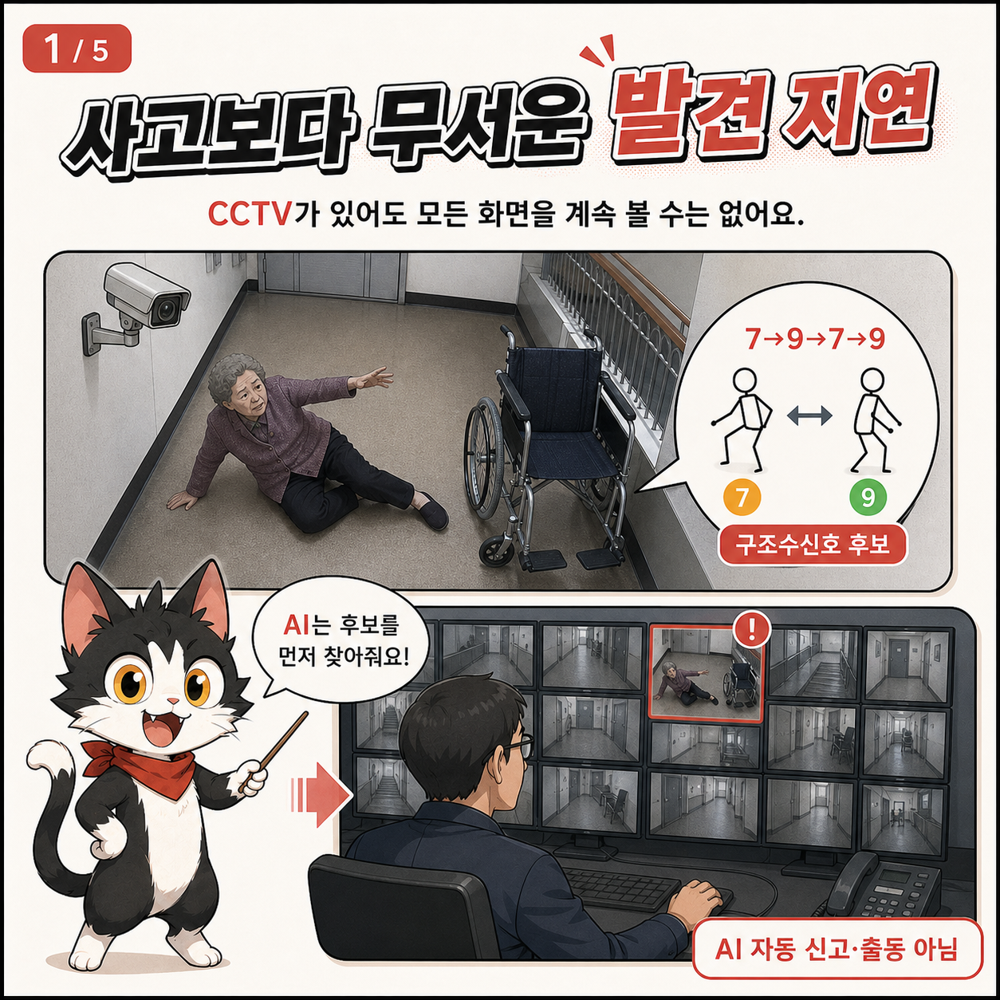
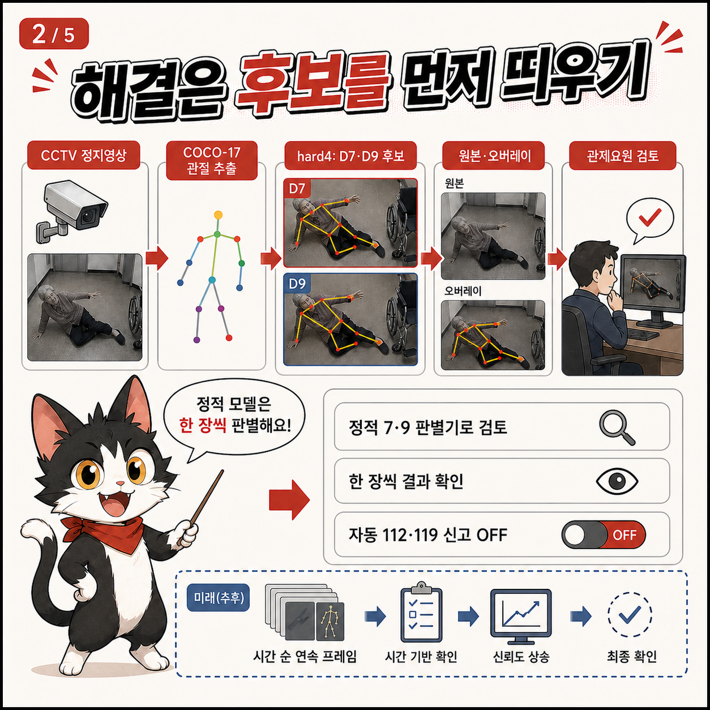
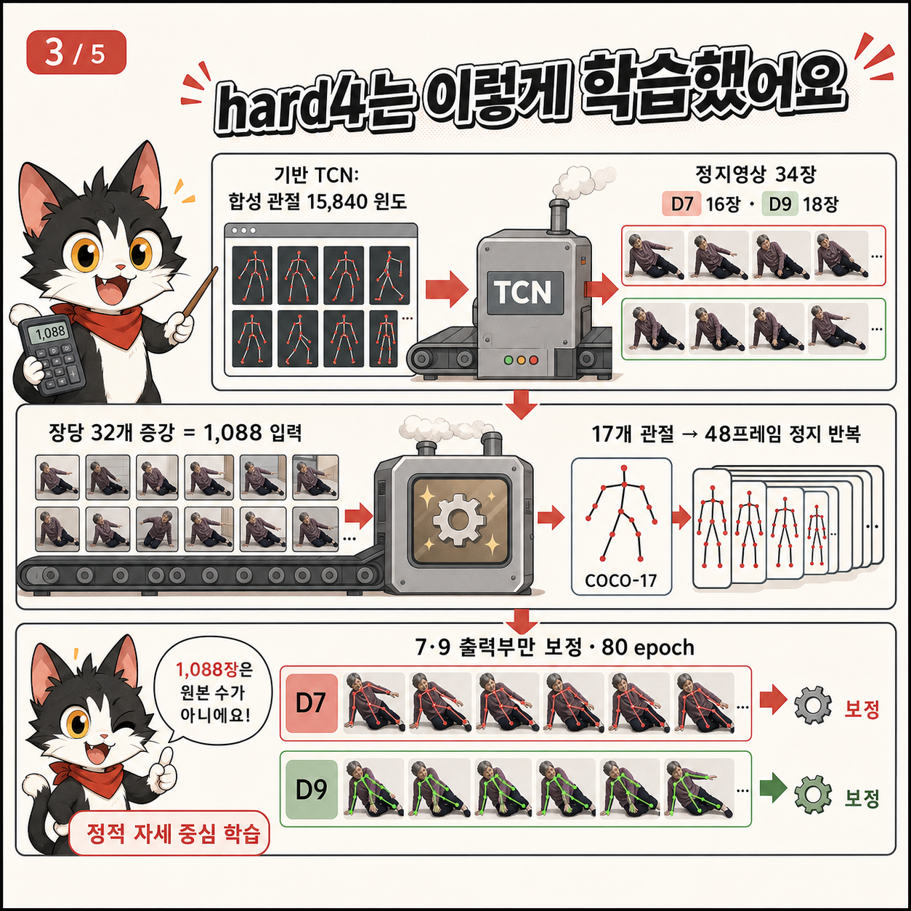
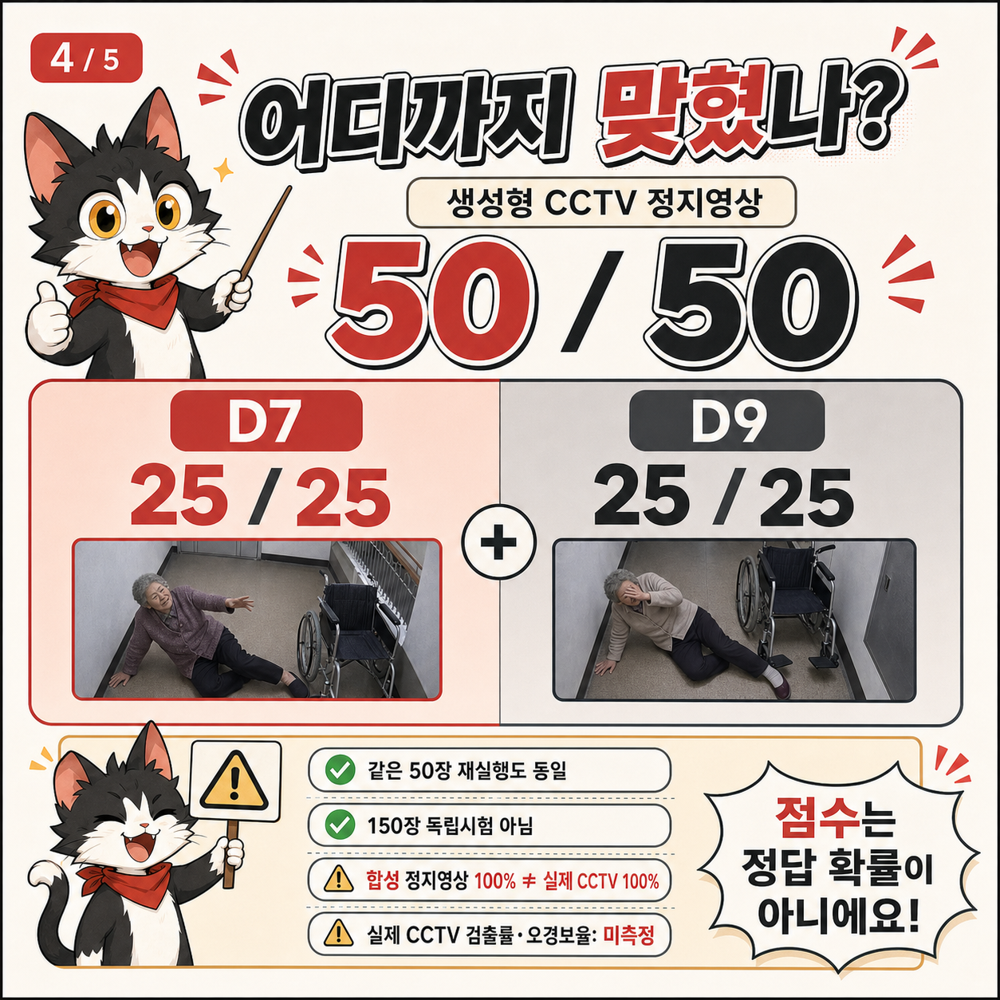
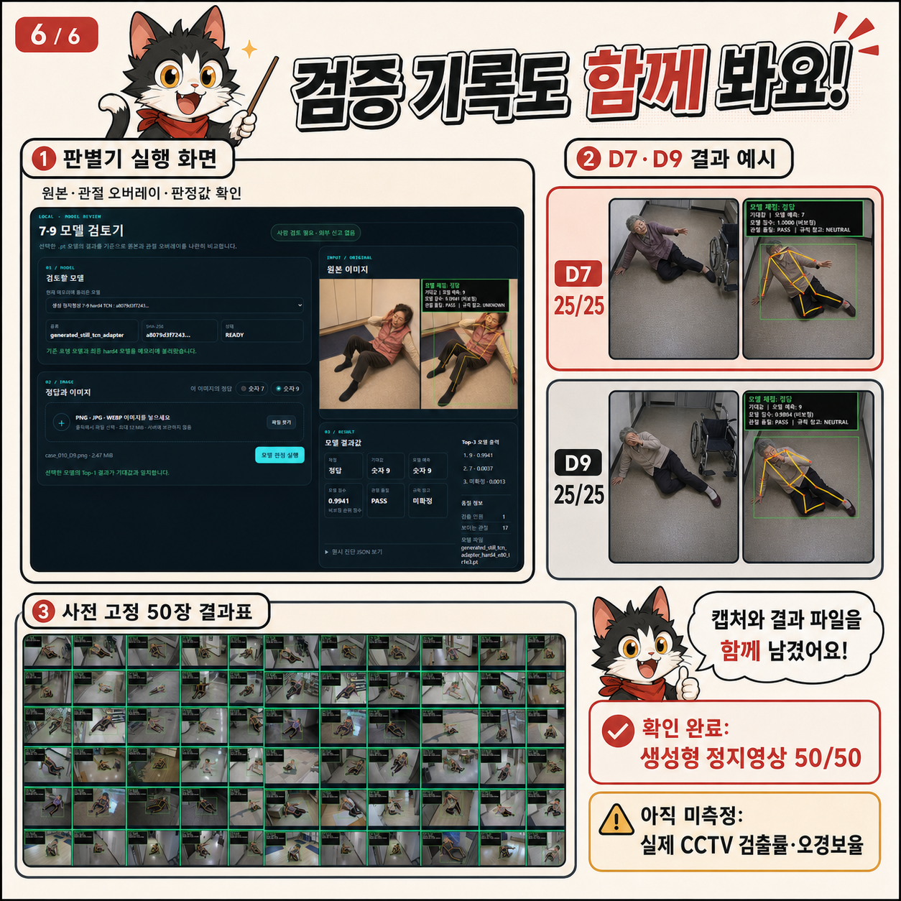
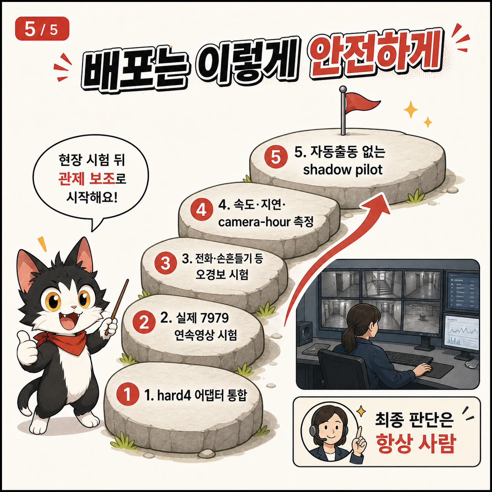

# gonggong-disaster-series-rescue79

## 사진 한 장의 7 자세와 9 자세를 눈으로 확인하는 로컬 AI 검토기

**사용 순서: 프로그램 켜기 → 정답 7 또는 9 선택 → 사진 선택 → 결과 확인**

이 프로그램은 사진 속 사람의 관절을 찾아, 자세가 숫자 7과 숫자 9 중 어느 쪽에
가까운지 보여 주는 **연구·교육·모델 시험용 프로그램**입니다. 원본 사진과 관절
그림을 나란히 보여 주므로 모델이 사람의 팔과 몸을 어떻게 보았는지 사람이 직접
확인할 수 있습니다.

> **꼭 읽어 주세요**
>
> - 이 프로그램은 실제 구조 요청을 확정하지 않습니다.
> - 자동으로 112나 119에 신고하지 않습니다.
> - 정지사진 한 장은 `7→9→7→9` 시간 순서를 증명하지 못합니다.
> - 결과는 반드시 사람이 원본 사진과 함께 확인해야 합니다.
> - 이 프로젝트의 7·9 자세는 사용자 정의 실험안이며 공식 국가표준이나 공인
>   긴급 구조 수신호가 아닙니다.

## 처음 사용하는 분을 위한 네 단계

최초 설치는 보호자, 교사, 전산 담당자처럼 컴퓨터 사용에 익숙한 사람이 한 번
준비해 주는 것을 권장합니다. 설치가 끝난 뒤에는 다음 네 단계만 따르면 됩니다.

### 1. 프로그램 켜기

프로그램 폴더의 `START_RESCUE79.cmd`를 더블클릭합니다. 검은색 실행 창은
프로그램이 작동하는 동안 닫지 마세요. 잠시 기다리면 브라우저가 열립니다.

### 2. 사진의 정답 고르기

사진이 7 자세라면 **숫자 7**, 9 자세라면 **숫자 9**를 선택합니다. 이 검토기는
사용자가 알고 있는 정답과 모델 예측을 비교하는 도구입니다.

### 3. 사진 고르기

**파일 찾기**를 눌러 PNG, JPG 또는 WEBP 사진 한 장을 선택합니다. 한 사람의
머리, 몸통과 양팔이 크고 선명하게 보이는 사진이 좋습니다.

### 4. 결과 확인하기

**모델 검토 시작**을 누릅니다. 왼쪽 원본과 오른쪽 관절 오버레이를 비교하고,
아래의 정답·모델 예측·관절 품질을 함께 확인합니다.

더 짧은 안내는 [초간단 사용법](QUICK_START_KO.md), 최초 설치는
[Windows 설치 안내](INSTALL_WINDOWS_KO.md)를 참고하세요.

## 왜 만들었나요?

넓은 공간이나 많은 CCTV 화면을 한 사람이 계속 지켜보면 중요한 장면을 늦게
발견할 수 있습니다. 위험에 처한 사람이 휴대전화를 쓰거나 큰 소리를 내기 어려운
경우도 있을 수 있습니다.

이 프로젝트는 사람이 특정 자세를 반복했을 때 관제요원이 원본 영상을 다시 살펴볼
수 있도록 후보를 알려 주는 방법을 연구하면서 시작했습니다. 현재 공개하는 정적
7·9 검토기는 그중 가장 작은 단계만 담당합니다.

- 사진에서 사람 한 명을 찾습니다.
- 머리, 어깨, 팔꿈치, 손목, 골반 등 COCO-17 관절을 찾습니다.
- 한 장의 자세가 7 또는 9 중 어느 쪽에 가까운지 보여 줍니다.
- 사람이 결과와 원본을 비교할 수 있게 관절선을 그려 줍니다.

실시간 CCTV 감시, 전체 `7979` 순서 확인, 구조 상황 판단과 자동 신고는 포함하지
않습니다.

## 7 자세와 9 자세는 무엇인가요?

여기서 숫자는 손가락으로 쓰는 숫자가 아니라 팔과 몸 전체의 모양을 뜻합니다.

### 숫자 7 자세

- 한 팔을 몸 옆으로 길게 뻗습니다.
- 다른 팔은 자연스럽게 쉽니다.
- 왼팔과 오른팔을 바꾸어도 같은 7로 봅니다.

### 숫자 9 자세

- 한 손을 머리 가까이에 둡니다.
- 다른 팔은 자연스럽게 쉽니다.
- 왼팔과 오른팔을 바꾸어도 같은 9로 봅니다.

머리를 긁기, 전화를 받기, 모자를 만지기 같은 평범한 행동도 9 자세와 비슷하게
보일 수 있습니다. 그래서 9 자세 한 장만 보고 구조 요청이라고 판단하면 안 됩니다.

## 언제 사용하면 좋은가요?

- AI가 사람의 관절을 어떻게 찾는지 배우는 수업
- 정답을 알고 있는 7·9 시험사진 확인
- 새로운 시험사진에서 모델이 7과 9를 구분하는지 점검
- 모델 버전 변경 전후의 결과 비교
- 관절이 가려졌을 때 판정을 보류하는지 확인
- 발표, 교육, 연구 시연
- 실제 CCTV 모델을 만들기 전의 초기 품질검사

## 언제 사용하면 안 되나요?

- 실제 응급상황 또는 구조 필요 여부를 판단할 때
- 112·119 신고 여부를 결정할 때
- 자동 신고, 자동 출동 또는 무인 관제를 할 때
- 정답을 모르는 사진에서 사람의 의도를 추측할 때
- 범죄·의료·안전 여부를 확정할 때
- 법적 증거 또는 공인 성능 자료로 사용할 때
- 여러 사람이 겹친 군중, 심한 가림, 야간·역광·비·안개 장면
- 실제 연속영상에서 완전한 `7→9→7→9`를 검출할 때

실제 긴급상황이라면 이 프로그램의 결과를 기다리지 말고 사람이 직접 주변을
확인하고 필요한 기관에 연락해야 합니다.

## 화면 결과의 쉬운 뜻

| 화면 표시 | 뜻 | 다음 행동 |
| --- | --- | --- |
| 정답 | 모델 예측이 사용자가 고른 정답과 같음 | 관절선도 올바른지 확인 |
| 오답 | 모델 예측이 사용자가 고른 정답과 다름 | 원본·관절선을 확인하고 시험 기록 |
| 판정 보류 | 사람이나 필요한 관절을 충분히 찾지 못함 | 더 선명한 한 사람 사진으로 다시 시험 |
| 오류 | 파일 또는 모델 처리 중 문제 발생 | 오류 문구를 확인하고 문제해결 문서 참고 |

`모델 점수`는 결과의 순위를 정하기 위한 **비보정 점수**입니다. 예를 들어
`0.99`라고 표시돼도 정답 확률, 구조 요청 확률 또는 신고 필요 확률이 99%라는
뜻이 아닙니다. 자세한 내용은 [결과 읽는 법](RESULT_GUIDE_KO.md)을 참고하세요.

## 모델을 어떻게 만들었나요?

아주 간단히 요약하면 다음과 같습니다.

1. 7과 9 자세를 한 생성형 정지 시험이미지를 준비했습니다.
2. 자세 인식기가 사람의 17개 관절 위치를 찾았습니다.
3. 정지 자세를 같은 자세가 유지되는 48프레임 입력 형태로 만들었습니다.
4. 기존 숫자 자세 모델의 7과 9 출력 부분만 추가 학습했습니다.
5. 틀렸던 어려운 사례 4개를 학습자료에 추가했습니다.
6. 학습에 넣지 않은 별도의 생성형 정지사진 50장으로 시험했습니다.

학습자료는 총 34장으로, 숫자 7이 16장이고 숫자 9가 18장입니다. 이미지마다 작은
회전, 이동, 크기 변화, 관절 흔들림과 좌우 반전을 적용했습니다. 전체 모델을 새로
학습한 것이 아니라 기존 모델의 숫자 7과 숫자 9 출력 부분을 조정한 방식입니다.

## 시험 결과와 정확한 해석

학습에 사용하지 않도록 미리 고정한 생성형 정지사진 50장을 시험했습니다.

| 시험 항목 | 결과 |
| --- | ---: |
| 숫자 7 생성형 정지사진 | 25/25 |
| 숫자 9 생성형 정지사진 | 25/25 |
| 전체 | 50/50 |
| 판정 보류 | 0 |
| 처리 오류 | 0 |

이 결과를 **실제 CCTV 정확도 100%**라고 표현하면 안 됩니다. 50장은 모두 7 또는
9가 보이도록 만든 생성형 양성 사례였습니다. 전화받기, 머리 긁기, 손 흔들기,
평범하게 걷기 같은 비신호 사례가 포함되지 않았으므로 실제 오경보율과 특이도는
측정할 수 없습니다.

현재 확인되지 않은 항목:

- 실제 사람·실제 CCTV 정확도
- 실제 구조신호 검출률
- 정상 행동을 잘못 경고하는 비율
- CCTV 한 시간당 오경보 수
- 완전한 `7→9→7→9` 시간 순서 검출률
- 연령, 체형, 장애, 복장, 거리와 환경별 성능

가장 정확한 공개 표현은 다음과 같습니다.

> 사전 고정한 생성형 7·9 정지사진 50장에서는 50장을 모두 구분했습니다.
> 실제 CCTV 성능과 오경보율은 아직 측정하지 않았습니다.

모델의 상세 범위는 [모델 카드](MODEL_CARD.md)를 참고하세요.

## 앞으로의 검증 계획

1. 서로 다른 실제 참여자와 촬영 환경에서 독립시험
2. 앉은 자세, 누운 자세, 보조기기 사용 등 다양한 조건 확인
3. 야간, 역광, 흐림, 원거리와 가림 시험
4. 전화받기, 머리 만지기, 손 흔들기 등 비신호 시험
5. 실제 연속영상에서 완전한 `7979` 순서 시험
6. 시간당 오경보, 미탐과 처리 지연시간 측정
7. 개인정보·기관 승인 후 사람 검토만 수행하는 shadow 운영

이 과정을 마치기 전에는 실제 현장 구조 모델이나 공인 안전 시스템으로 소개하지
않습니다.

## 설치와 자세한 도움말

공식 ZIP 또는 Git 소스 폴더에서 실행하세요. 이 초기 연구판은 PyPI 패키지나
독립 `pip install` wheel 설치를 지원하지 않습니다.

| 문서 | 누구를 위한 문서인가요? |
| --- | --- |
| [초간단 사용법](QUICK_START_KO.md) | 프로그램을 사용하는 어린이·고령자·처음 사용자 |
| [Windows 설치 안내](INSTALL_WINDOWS_KO.md) | 최초 설치를 돕는 보호자·교사·전산 담당자 |
| [결과 읽는 법](RESULT_GUIDE_KO.md) | 정답·오답·판정 보류와 점수 해석이 필요한 사용자 |
| [안전과 개인정보](SAFETY_AND_PRIVACY_KO.md) | 사진·CCTV 자료를 안전하게 다루어야 하는 사용자 |
| [문제 해결](TROUBLESHOOTING_KO.md) | 실행·다운로드·사진 처리 문제가 생긴 사용자 |
| [만화 대체텍스트](docs/COMICS_ALT_TEXT_KO.md) | 화면낭독기 이용자와 그림 내용을 글로 읽고 싶은 사용자 |

## 개인정보 요약

기본 실행은 사용자 컴퓨터 안에서만 작동하며 자동 신고 기능이 없습니다. 검토기는
선택한 이미지와 모델의 임시 파일을 처리 후 보관하지 않도록 설계됐습니다. 하지만
원본 사진과 사용자가 직접 만든 화면 캡처는 각자의 저장 폴더에 남습니다.

실제 CCTV 원본, 얼굴, 이름, 주소, 차량번호와 같은 개인정보를 GitHub·GitLab 이슈에
올리지 마세요. 자세한 내용은 [안전과 개인정보](SAFETY_AND_PRIVACY_KO.md)를
따르세요.

## 라이선스

프로젝트가 작성한 소스코드와 `models/rescue79-hard4-portable-v1.pt` 가중치는 MIT
라이선스로 공개됩니다. 생성형 만화·시험 캡처·예제의 프로젝트 소유자 허가 범위는
[자산 라이선스](ASSET_LICENSE.md)에 적었습니다. 자세한 범위는
[모델 라이선스](MODEL_LICENSE.md)와 저장소의 `LICENSE`를 따릅니다.

RGB 사진에서 관절을 찾는 Torchvision COCO 자세 가중치는 이 저장소와 hard4
체크포인트에 포함되지 않으며 프로젝트 MIT 라이선스로 재허가되지 않습니다. 해당
가중치와 Python 라이브러리는 각각의 별도 조건을 따릅니다. 자세한 내용은
[제3자 고지](THIRD_PARTY_NOTICES.md)를 확인하세요.

## 문제를 제보할 때

다음 정보만 포함하세요.

- Windows 버전
- 프로그램 버전 또는 Release 이름
- 오류 문구
- 모델 파일의 SHA-256
- 개인정보를 가린 화면 캡처
- 문제를 다시 만드는 순서

실제 CCTV 원본이나 개인정보가 담긴 사진은 공개 이슈에 첨부하지 마세요.
